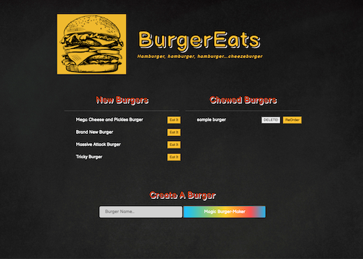

# Burger-Burger

_**Hamburger, hamburger, hamburger, hamburger, cheezeburger!**_

## Table of Contents

- [Description](#Description)
- [Technologies](#Technologies)
- [Installation](#Installation)
- [Screenshots](#Screenshots)
- [Repository](#Repository)
- [Deployment](#Deployment)

## Description

A bitty CRUD app that let's you eat, create, or delete the burger of choice. Following the MVC design patter, this app utilizes several techonologies, an ORM, and a templating engine to generate HTML.

## Technology

Technologies utilized include

- Node.js
- Express
- MySQL database
- NPM packages
  - [MySQL](https://www.npmjs.com/package/mysql)
  - [Express handlebars](https://www.npmjs.com/package/express-handlebars)
- Bootstrap
- Google Fonts

## Installation

To run this application you must have **Node.js** installed. Then:

1. From the terminal intall dependancies `npm install` or `npm i` and `ENTER`.
2. Once "installed", be sure that all npm packages listed above are in your `node_modules` folder.

## Screenshot

 

## Repository

- GitHub Repo/Code: https://github.com/jenneration/Burger-Burger

## Deployment

- Heroku
  ––
